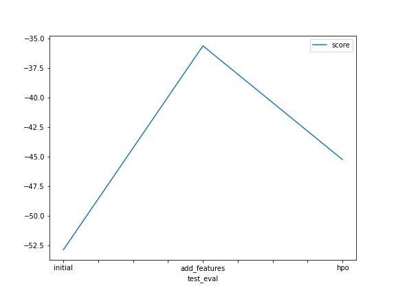

# Report: Predict Bike Sharing Demand with AutoGluon Solution
#### Masinde Mtesigwa Masinde

## Initial Training
### What did you realize when you tried to submit your predictions? What changes were needed to the output of the predictor to submit your results?
The Initial score was 1.80790 and the Best model was "WeightedEnsemble_L3"

### What was the top ranked model that performed?
The best top ranked model in Initial training was "WeightedEnsemble_L3"

## Exploratory data analysis and feature creation
### What did the exploratory analysis find and how did you add additional features?
Here I did 

* Feature engineering
Transforming the weather and season columns to category from ints since autogluon sees them as ints.
Parsing the datetime to separate features for further analyis

* Plotting the distribution of registered vs casual rides.
The findings were as follows:
The registered users perform way more rides than casual ones. Furthermore, we can see that the two distributions are skewed to the right, meaning that, 
for most of the entries in the data, zero or a small number of rides. Finally, every entry in the data has quite a large number of rides (that is, higher than 800).
 * correlation 
     *  correlation between rides and temperature
     The higher temperatures have a positive impact on the number of rides (the correlation between registered/casual rides and temp is 0.31 and 0.46, respectively, and it's a  similar case for atemp). Note that as the values in the registered column are widely spread with respect to the different values in temp, we have a lower correlation compared to the casual column.  
     * Correlation between rides and humidity 
     * Correlation between the number of rides and the wind speed 
     * Correlation Matrix Plot 

The conclusion of the visualization is that when the temperature is good the hire of the bike is good for both registered users and casual users.

### How much better did your model preform after adding additional features and why do you think that is?
The model performed better after changing some of the columns/features to categorical data and also after adding new features, from the score of 1.8 to 1.33

## Hyper parameter tuning
### How much better did your model preform after trying different hyper parameters?
After hyperparameter tuning, the model slightly changed from the score of 1.33 to 1.32

### If you were given more time with this dataset, where do you think you would spend more time?
I will spend more time doing the data analysis to get to know data in detail trying different analysis methods.

### Table with the models you ran, the hyperparameters modified, and the kaggle score

### A line plot showing the top model score for the three (or more) training runs during the project.

### Create a line plot showing the top kaggle score for the three (or more) prediction submissions during the project.

## Summary
When new features are added the train time was reduced as well as when tuned the hyperparameters
* **Initial**
The training time takes is very long compered to when feature engineering was applied
There was no data preprocessing in the initial stage of training which is good feature
 * **New features**
The score was improved as well as the training time. The new features which were added during feature engineering enhaced the model training fro better  results
* **Hyperparameter Tuning**
The time for training was a lot faster compared to the other stages.
* **Lessons learnt**
Many models are better than few and hyperparemeter tuning enhances learning.
There is no train split manually the model does that internally

